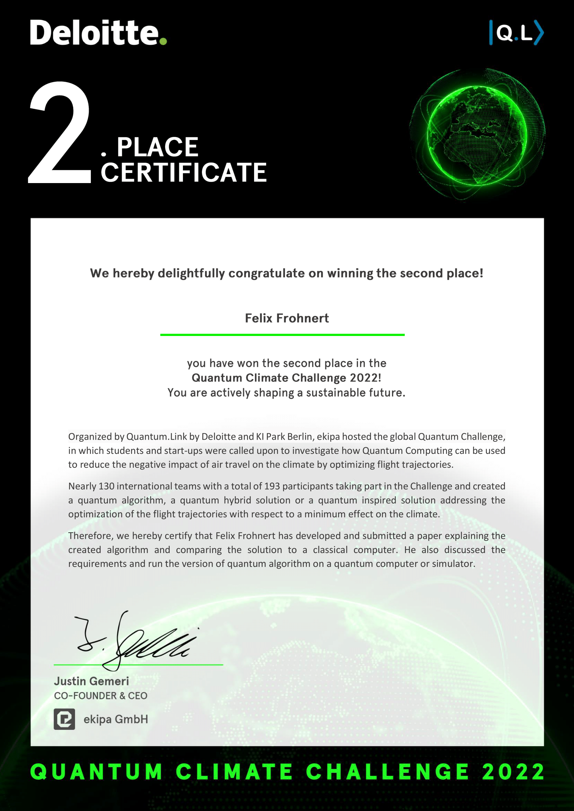

# Presentation
The slides used for the final pitch of the competition can be accessed via the following link:

https://docs.google.com/presentation/d/1ykRrBzCtyXQL5KJPWq4Q7lcP9V0t40od7l0uFsD5T3E/edit?usp=sharing

More information on the challenge and the pitch event can be found via the following link:

https://app.ekipa.de/challenges/deloitte-quantum/brief

# Quantum-Challenge
The Deloitte Quantum Climate Challenge 2022 aims to explore how the contribution of aviation to the anthropogenic climate change can be reduced by optimizing flight routes using hybrid
quantum-classical algorithms. The case-study includes a sample of multiple flights with different
flight paths and flight schedules. The flight routes are to be optimized in such a way that the
warming of the climate is minimal, taking into account all flights, while at the same time being
compatible with flight safety regulations. Different climate effects occur depending on fuel consumption, the geographic location, flight altitude, weather conditions, and flight times. To solve
this problem efficiently on a quantum computer, the problem was split into two separate combinatorial optimization problems: Finding a set of climate-optimized trajectories and disentangling the
resulting flight plan. The first problem is solved using Grover’s search algorithms, and the second
problem is solved using the filtering variational quantum eigensolver.

# Files in the repository
    Quantum-Challenge
      |-- cluster
            |-- bada_data.csv # Base of Aircraft Data detailing speed, fuel consumption and other parameters as a function of flight level
            |-- controlscript.pbs # cluster control
            |-- launch.sh # cluster control
            |-- q_opt_traj.npy # output, array of generated trajectories
            |-- run.py # launch script
      |-- data
            |-- climate_df.pkl # climate impact of burning CO2 as a function of coordiante and time 
            |-- climb_df.pkl # velocity and fuel consumption data for climbing aircrafts
            |-- cruise_df.pkl # velocity and fuel consumption data for cruising aircrafts
            |-- descent_df.pkl # velocity and fuel consumption data for descending aircrafts 
            |-- flights.csv # coordinates of start and end point of flights 
      |-- notebooks
            |-- Preliminaries # Contains code to adapt the provided data for the appropriate problem formulations
            |-- Classical Optimization # Contains the two classical trajectory optimizations that will be used as benchmarks
            |-- Trajectory Optimization # Contains the quantum trajectory optimization run on a 16-qubit simulator and a 16-qubit IBM processor
            |-- Trajectory Visualization # Contains the visualization of the trajectories calculated above
            |-- Conflict Resolution # Contains the QUBO formulation of the conflict resolution problem from the computed trajectories, solved with Filtering-VQEs
      |-- utils
            |-- utils.py # module with various functions 
      |-- README
      

